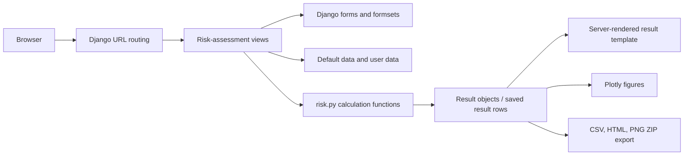

# QMRA application architecture baseline

## Scope

This is a concise description of the current architecture of [`KWB-R/qmra-webapp`](https://github.com/KWB-R/qmra-webapp), based exclusively on the repository's current `main` branch. It describes the system as implemented today; it is not a target architecture or a proposal for change.

## 1. System shape

QMRA is a Django web application implemented in Python. It serves server-rendered HTML pages from Django templates and executes risk calculations synchronously during web requests. The WSGI entry point is `qmra.wsgi:application`.

The main runtime components are:

- **Django project (`qmra/`)**: settings, top-level URL routing, public pages, health/readiness endpoints, authentication integration, and WSGI configuration.
- **Risk-assessment application (`qmra/risk_assessment/`)**: assessment models, scientific default-data access, forms, views, calculation logic, charts, exports, templates, and admin integration.
- **User application (`qmra/user/`)**: the custom user model, registration, login/logout, password changes, and account deletion.
- **Django templates and static data**: server-rendered configurator/result pages plus JSON files containing the checked-in scientific defaults.
- **Django admin**: administration of users and default scientific entities.
- **Single web deployment**: the repository's Docker Compose configuration defines one `web` service running Gunicorn.

There is no separate public scientific API, calculation service, background worker, queue, cache, or external scientific engine in the inspected repository. The JSON listing endpoints for personal sources, exposures, and treatments are application endpoints, not a separate API layer.

## 2. Runtime and deployment boundary

The container is based on Python 3.12, installs the Django application and its Python dependencies, and runs Gunicorn on port 8080. Docker Compose runs static-file collection and database migrations before starting Gunicorn.

The Compose configuration mounts:

- a SQLite database directory for the application database; and
- a directory used for collected static files.

The deployment passes `DOMAIN_NAME` into the container. The repository does not define an external database, object store, message broker, or cache. Operational settings such as production secret management, TLS, backups, and retention are not defined in the repository.

Django Prometheus middleware and URL endpoints expose metrics. `django-structlog` is used for request logging. `/health` and `/ready` force a database connection and return `Ok` when the check succeeds.

## 3. Main application flow

The principal request path is:

The configurator collects one assessment definition, inflows, and an ordered treatment train. The views validate the submitted forms, resolve pathogen and default-data definitions, invoke the calculation functions, and pass result statistics to Django templates. Plotly figures are embedded as HTML for normal web pages. Export requests render the figures to PNG using Kaleido and package them with CSV and HTML files.

## 4. Persistence and data ownership

The application defines two SQLite databases and routes models between them with `qmra.risk_assessment.dbrouter.DBRouter`.

| Store | Current purpose | Main contents |
|---|---|---|
| `default` SQLite database | Application and user-owned data | Django users, saved assessments, assessment inflows, assessment treatments, saved result rows, and personal reusable definitions |
| `qmra` SQLite database | KWB-managed default scientific entities | Django models whose class name contains `QMRA`, routed by the database router |
| Checked-in JSON files under `qmra/static/data/` | Runtime default-data source for static entity wrappers and bootstrap/export data | Pathogens, sources, exposures, treatments, pathogen-group parameters, references, and related default values |

The default scientific model module (`qmra_models.py`) contains both Django models for default entities and `StaticEntity` wrappers. The wrappers read the JSON files dynamically for form choices and calculation lookup rather than reading the `qmra` database directly. The module documents the JSON files as the bootstrap/export representation for the default database. Admin operations on QMRA default models trigger default-data export and static-file collection.

This creates an important current boundary: default scientific data exists both as administrable database models and as checked-in JSON consumed by application code. The repository does not make the long-term source-of-truth or synchronization lifecycle explicit.

### Application assessment model

The user/application database models are:

- **`RiskAssessment`**: UUID, owner, timestamps, name, description, source and exposure names, events per year, volume per event, and related inflows, treatments, and results.
- **`Inflow`**: UUID, assessment, pathogen name, and minimum/maximum concentration. Form values are presented in `N/L`.
- **`Treatment`**: UUID, assessment, name, ordered `train_index`, and minimum/maximum LRVs for bacteria, viruses, and protozoa. It also detects configured maximum LRVs above 6 for warning display.
- **`RiskAssessmentResult`**: assessment, pathogen, infection/DALY risk categories, and min/max/q1/q3/median statistics for both minimum-LRV and maximum-LRV cases.

Assessment children and results are deleted with their assessment. Saved results are recalculated when required by the view layer.

Personal reusable definitions are stored separately in `UserExposure`, `UserSource`, and `UserTreatment`. Personal source values are currently modeled for the same three pathogens used by the assessment forms.

## 5. Calculation boundary

The calculation implementation is in `qmra/risk_assessment/risk.py` and is called directly by Django views.

The current calculation flow is:

1. Resolve a pathogen model and pathogen group.
2. Sum treatment LRVs by pathogen group. `None` LRV values are treated as zero.
3. Calculate one case using the summed maximum LRV and one using the summed minimum LRV.
4. Sample inflow concentrations in log space.
5. Subtract the selected constant LRV and convert concentration to dose using event volume.
6. Apply the pathogen dose-response distribution.
7. Sample event probabilities over simulated years and events.
8. Calculate annual risk as `1 - product(1 - event_probability)`.
9. Convert infection probability to DALYs using the pathogen's infection-to-illness factor and DALYs-per-case value.
10. Compute min, max, first quartile, third quartile, and median statistics and assign categories against the current reference levels of `1e-4` infection probability and `1e-6` DALYs.

`get_annual_risk()` creates a NumPy random generator with seed `42` and defaults to 10,000 events and 1,000 years. The supported pathogen distributions in the default model are exponential and beta-Poisson.

The calculation does not currently model treatment failure, downtime, failure sequences, changing operating conditions, or a separate combined-failure mechanism. There is no persisted calculation-engine version or simulation-settings record in the inspected application model.

## 6. Main user workflows

### Anonymous assessment

1. An unauthenticated visitor opens the assessment configurator.
2. Django renders the risk-assessment form, three inflow forms for the current pathogens, and a treatment formset.
3. The visitor submits the forms to the result flow.
4. The forms validate events/year, volume/event, concentrations, concentration ranges, LRV ranges, and treatment-form limits.
5. The view calls `assess_risk(..., save=False)`.
6. The result page renders risk statistics and two Plotly charts without persisting the assessment.

The treatment formset supports up to 30 treatment steps and supports deletion. The anonymous configurator has no save controls.

### Registered-user assessment

1. Django session authentication identifies the user.
2. The authenticated root flow leads to the saved-assessment list.
3. Creating or editing an assessment saves the assessment, inflows, and ordered treatments inside the creation transaction.
4. Duplicate assessment names are handled by appending ` (2)`.
5. Existing results are removed before recalculation; `assess_and_save_results` calculates and stores fresh `RiskAssessmentResult` rows.
6. Saved assessments are listed newest first and can be opened for editing or deleted.
7. A result view recalculates and saves results when an assessment has no stored results.

The user application uses Django's session authentication and the custom user model is an empty subclass of `AbstractUser`. No application-specific roles for engineers, operators, regulators, or researchers are implemented.

### Personal reusable definitions

Authenticated users can create personal exposure, source, and treatment definitions. Listing endpoints return the current user's definitions as JSON; anonymous list requests return an empty object. These definitions are selected by the form/UI layer and remain user-owned data rather than becoming shared defaults.

### Export

A saved assessment can be exported as a ZIP archive containing:

- `exposure-assessment/inflows.csv`;
- `exposure-assessment/treatments.csv`;
- an assessment result CSV;
- an HTML report;
- `results-plots/infection-probability.png`; and
- `results-plots/dalys-pppy.png`.

Pandas assembles the tabular exports, Plotly creates the figures, and Kaleido renders figures to PNG bytes. No Excel export is implemented in the inspected repository.

## 7. Presentation and integration boundaries

- **Presentation**: Django server-side templates, Crispy Forms, and Bootstrap 4. The configurator uses template partials and JavaScript for dynamic form behavior and guided-tour content.
- **Application logic**: Django views coordinate validation, persistence, calculation calls, result rendering, and exports.
- **Scientific calculation**: NumPy-based functions in `risk.py`; no independent service boundary exists.
- **Default scientific data**: JSON/static entities and QMRA-routed Django models, with the dual-representation boundary described above.
- **Persistence**: Django ORM over two SQLite databases selected by a database router.
- **Authentication**: Django users and sessions.
- **Observability**: Prometheus middleware/endpoints and structlog-based request logging.
- **Deployment**: Docker Compose and Gunicorn in a single web service.

The assessment-list template contains UI text for selecting or comparing assessments, but no separate implemented comparison calculation or view was found in the inspected code.

## 8. Open questions for possible ADR treatment

These are unresolved or insufficiently explicit architectural points in the repository. They are recorded as questions, not decisions or recommendations.

- What is the intended source of truth and lifecycle for default scientific data: the `qmra` database, the JSON files, or synchronization between both?
- Is routing models by whether the class name contains `QMRA` intended to remain the long-term database boundary?
- Should calculation continue to be called directly from Django views, or is a stable internal calculation-engine boundary intended?
- How should model/data versions and simulation settings be represented for saved results and exports?
- How should historical assessments behave after scientific default data or calculation logic changes?
- Is assessment comparison intended to become a real workflow, given the existing list-template UI text but no dedicated implementation?
- Several inspected view paths retrieve `RiskAssessment` by ID without an explicit `user=request.user` filter. Is ownership scoping guaranteed elsewhere, or does this boundary require verification?
- Which production security and operational settings are required for deployment? The repository currently includes development-oriented fallbacks such as `DEBUG=True`, a fallback secret key, and a dummy email backend; TLS, backup, and retention policies are not defined here.

## Evidence in the repository

- [README.md](https://raw.githubusercontent.com/KWB-R/qmra-webapp/main/README.md) — application and deployment overview.
- [requirements.txt](https://raw.githubusercontent.com/KWB-R/qmra-webapp/main/requirements.txt) — Python dependencies and integrations.
- [Dockerfile](https://raw.githubusercontent.com/KWB-R/qmra-webapp/main/Dockerfile) and [docker-compose.yml](https://raw.githubusercontent.com/KWB-R/qmra-webapp/main/docker-compose.yml) — container and runtime boundary.
- [qmra/settings.py](https://raw.githubusercontent.com/KWB-R/qmra-webapp/main/qmra/settings.py), [qmra/urls.py](https://raw.githubusercontent.com/KWB-R/qmra-webapp/main/qmra/urls.py), and [qmra/wsgi.py](https://raw.githubusercontent.com/KWB-R/qmra-webapp/main/qmra/wsgi.py) — project configuration, routing, and entry point.
- [risk_assessment/models.py](https://raw.githubusercontent.com/KWB-R/qmra-webapp/main/qmra/risk_assessment/models.py), [qmra_models.py](https://raw.githubusercontent.com/KWB-R/qmra-webapp/main/qmra/risk_assessment/qmra_models.py), [user_models.py](https://raw.githubusercontent.com/KWB-R/qmra-webapp/main/qmra/risk_assessment/user_models.py), and [dbrouter.py](https://raw.githubusercontent.com/KWB-R/qmra-webapp/main/qmra/risk_assessment/dbrouter.py) — persistence and database routing.
- [risk.py](https://raw.githubusercontent.com/KWB-R/qmra-webapp/main/qmra/risk_assessment/risk.py), [views.py](https://raw.githubusercontent.com/KWB-R/qmra-webapp/main/qmra/risk_assessment/views.py), and [forms.py](https://raw.githubusercontent.com/KWB-R/qmra-webapp/main/qmra/risk_assessment/forms.py) — calculation, orchestration, validation, and workflows.
- [exports.py](https://raw.githubusercontent.com/KWB-R/qmra-webapp/main/qmra/risk_assessment/exports.py) and [plots.py](https://raw.githubusercontent.com/KWB-R/qmra-webapp/main/qmra/risk_assessment/plots.py) — export and visualization boundaries.
- [default data](https://github.com/KWB-R/qmra-webapp/tree/main/qmra/static/data) and [templates](https://github.com/KWB-R/qmra-webapp/tree/main/qmra/risk_assessment/templates) — checked-in scientific data and server-rendered UI.
